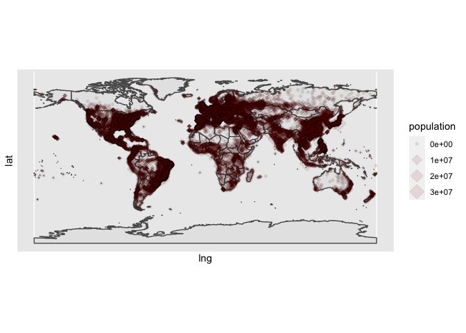

<!-- README.md is generated from README.Rmd. Please edit that file -->

# worldcities

<!-- badges: start -->
<!-- badges: end -->

`worldcities` contains a dataset of 40,000 cities and associated
metadata such as coordinates, country, and population.

## Installation

You can install the released version of worldcities from github with:

``` r
remotes::install_github("condwanaland/worldcities")
```

## Example

To use `worldcities` first load it with `library()`

``` r
library(worldcities)
```

You can then access the dataset by just calling `worldcities`

``` r
wc <- worldcities
head(wc)
#>       city     lat      lng     country iso2 iso3  admin_name capital
#> 1    Tokyo 35.6897 139.6922       Japan   JP  JPN       Tokyo primary
#> 2  Jakarta -6.2146 106.8451   Indonesia   ID  IDN     Jakarta primary
#> 3    Delhi 28.6600  77.2300       India   IN  IND       Delhi   admin
#> 4   Mumbai 18.9667  72.8333       India   IN  IND Maharashtra   admin
#> 5   Manila 14.6000 120.9833 Philippines   PH  PHL      Manila primary
#> 6 Shanghai 31.1667 121.4667       China   CN  CHN    Shanghai   admin
#>   population         id
#> 1   37977000 1392685764
#> 2   34540000 1360771077
#> 3   29617000 1356872604
#> 4   23355000 1356226629
#> 5   23088000 1608618140
#> 6   22120000 1156073548
```

You can then use this in any further analyses

``` r
library(ggplot2)
library(rnaturalearth)
library(rnaturalearthdata)

# This grabs a map of the world from the `rnaturaldata` packages
world <- ne_countries(scale = "medium", returnclass = "sf")

ggplot(data = world) +
    geom_sf() +
    geom_point(data = worldcities, aes(x = lng, y = lat, size = population), 
        shape = 23, fill = "darkred", alpha = 0.1) +
    coord_sf()
#> Warning: Removed 738 rows containing missing values (geom_point).
```


There’s way too much data to get anything meaningful from this view, but
it does give you an idea of the areas this dataset covers.

## License

Data for this package comes from SimpleMaps
(<https://simplemaps.com/data>). The World Cities data is released under
a CCBY license which is preserved here. The original, raw data can be
found here (<https://simplemaps.com/data/world-cities>).
